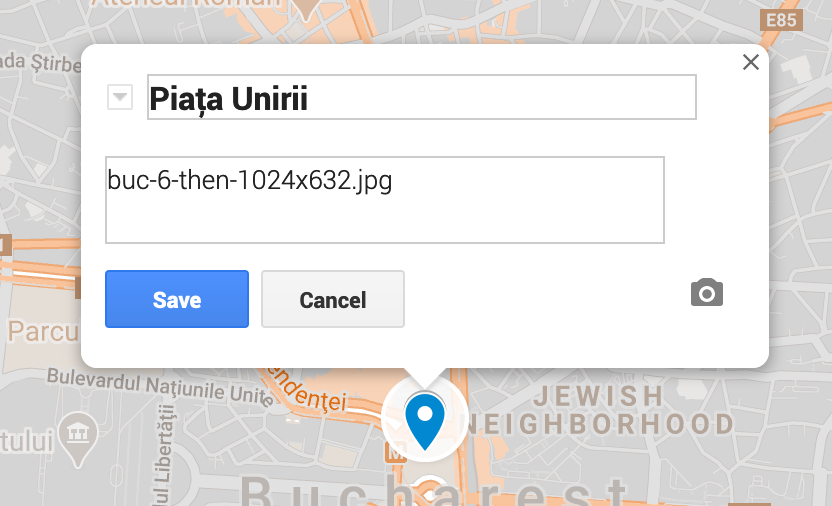
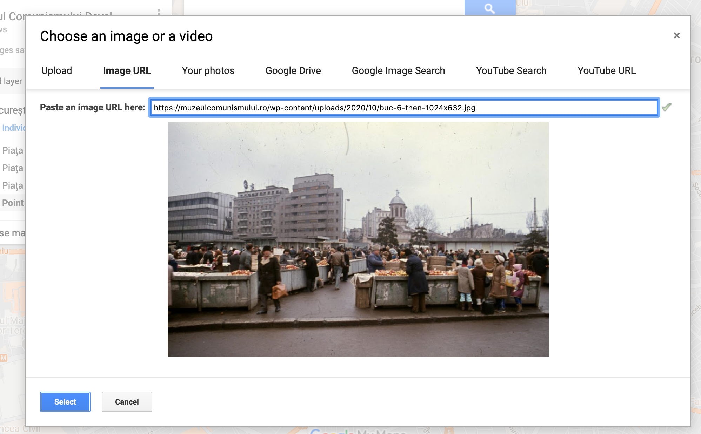
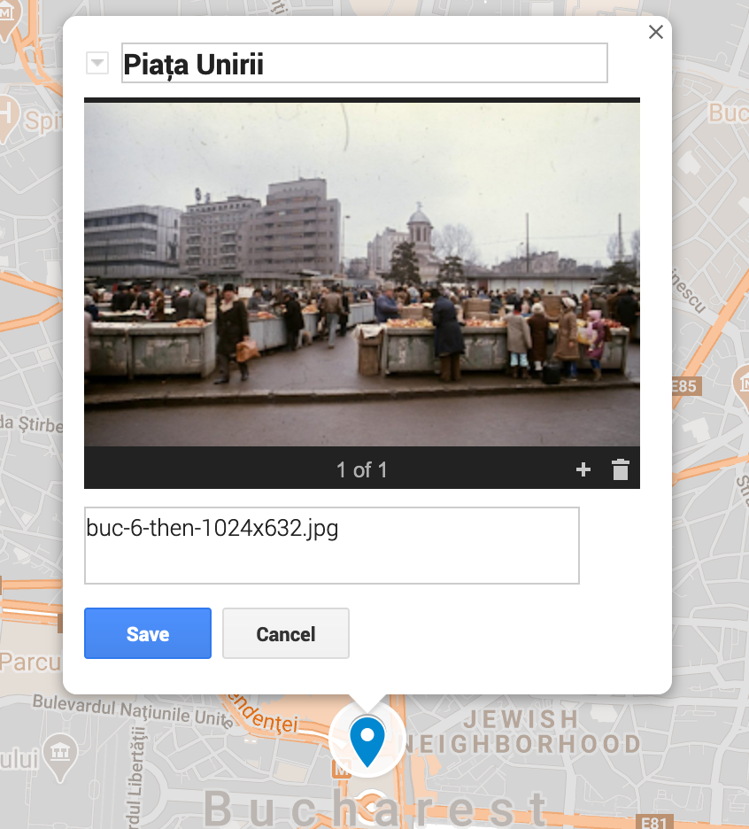

# Adding locations

1. Open MyMaps:
   https://www.google.com/maps/d/edit?mid=1UGUufFwlGg1qbSMTjqf8B6ajfwDgxfLh

1. Create a new place marker. Add the image filename to the description.
    

1. Add a photo for easy reference. This will not be used by the embedded map,
   but it makes editing the locations easier.
    

1. Done. This is what the place marker should look like.
    
